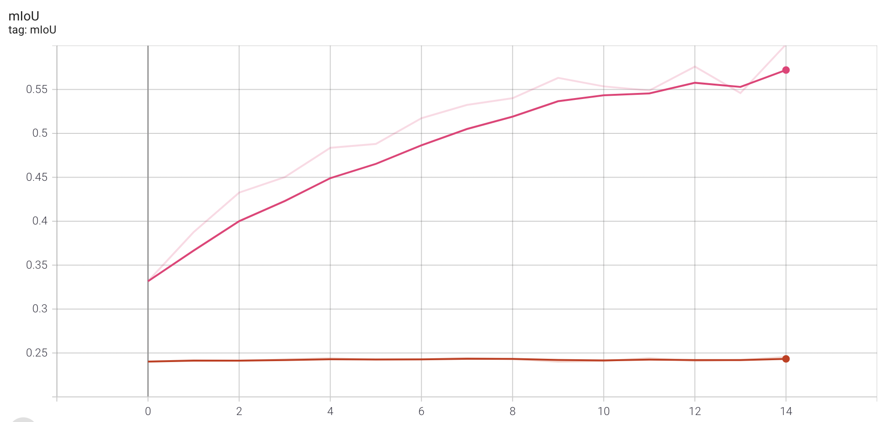
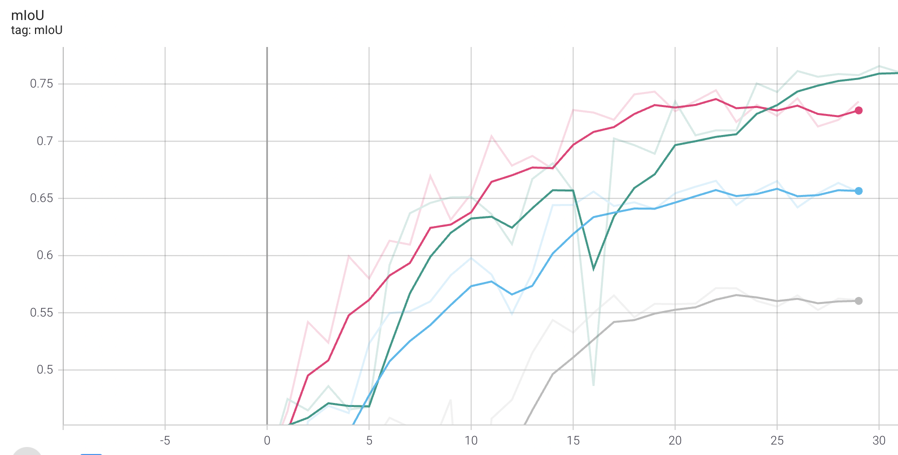
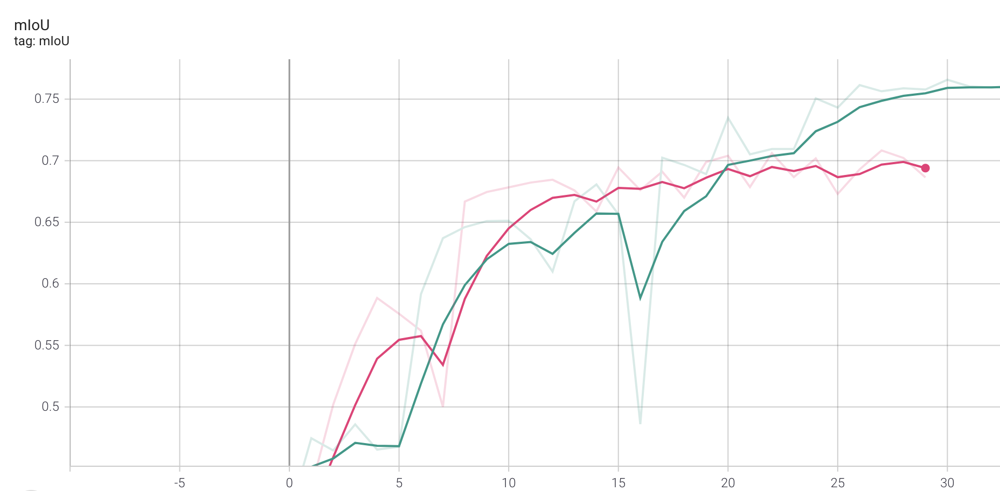

# salt-identification-pytorch
PyTorch package for training a unet/unet-resnet model from the command line.

## Beginner Mistakes With Pytorch

This package is a result of months of trial and error, slowly improving the results of this unet/unet-resnet model.
The model performed poorly in some settings due to implementation mistakes, so I will use this readme to document some mistakes that if you make, altough the model will still be working, it will perform much much poorer than it can.

First I will show how to use this package:

### Installation

1. Clone the repository on your local machine:
```
git clone https://github.com/rooncal/salt-identification-pytorch.git
cd salt-identification-pytorch
```
2. Install dependencies
For PyTorch dependency, see pytorch.org for more details.

For custom dependencies:
```
pip install PIL tqdm
```

### Training

1. Configure your dataset path in `mypath.py`.

1. Run `python train.py` with your desired arguments (see possible arguments with `python train.py -h`):
```
usage: train.py [-h] [--model {unet,unet-resnet}]
                [--dataset {tgs_salt_identification}] [--no-bn]
                [--loss-function {ce,dice,focal,combo}] [--epochs N]
                [--start_epoch N] [--batch-size N] [--lr LR]
                [--lr-scheduler {reduce-on-plateau,step,cos}] [--momentum M]
                [--weight-decay M] [--nesterov] [--no-cuda]
                [--gpu-ids GPU_IDS] [--resume RESUME] [--no-tqdm]
                [--optimizer {adam,RMSProp,SGD}] [--patience PATIENCE]
                [--experiment-name EXPERIMENT_NAME]
                [--tensorboard-dir TENSORBOARD_DIR]
                [--checkpoint-dir CHECKPOINT_DIR]
```

## The Mistakes

### Mistake 1: Not Making Sure The Mask Is In The Correct Number Range
When I made the first version of this model I got very strange results and sometimes the training failed randomly and some loss functions such as BCE didn't work at all. Turns out that since this model uses PNG images the masks provided had 65335 instead of 1 on the salt classified pixels, so this messed up evaluation completely. This was fixed by adding a transformation that divides the mask by 65335, but can also be fixed in the Dataset object.

### Mistake 2: Not Using BatchNorm
This is actually not a mistake I made but an experiment that I conducted (that you can also do yourself with this package by adding the `--no-bn` argument to training).
When you don't use batchnorm, turns out your model performs way, way worse in this case:


* Pink: Dice loss with BN
* Red: Dice Loss without BN

In this image you can see two models training with Dice Loss, one without and one with BatchNorm.

This was done by replacing the BatchNorm2d with a module called Nothing that simply passes forward the input when called, whenever the `--no-bn` argument is used.

### Mistake 3: Misusing Transformations
When first training the model, I couldn't get mIoU above 0.7 for any loss function except Dice. Turns out this was due to a bad use of the Resize transformation. Originally I resized the images to (256,256), but when I reduced the size to (128,128) my results for other loss functions improved dramatically as well as training speed since I could increase the batch size.
Transformations can seem like a quick addition to improve results for beginners, but they can destroy your results if you are not careful.

## Comparing Different Loss Functions
In this package I gave 4 different loss functions you can use (Binary Cross Entropy Loss, Dice Loss, Focal Loss and Combo Loss) and I have trained with all of them and compared the results:


* Pink: Dice Loss
* Green: Combo Loss
* Cyan: CE Loss
* Grey: Focal Loss

## Training Without Nonessential Transformations
I also tried training with and with nonessential transformations. The transformations I used were RandomHorizontal/Vertical flip, and RandomRotate.
Training without these transformations seems to have worse results:


* Green: Combo loss with nonessential transformations
* Pink: Combo loss without nonessential transformations


### Acknowledgements
* [pytorch-deeplab-xception](https://github.com/jfzhang95/pytorch-deeplab-xception)
* [Pytorch-UNet](https://github.com/milesial/Pytorch-UNet)

